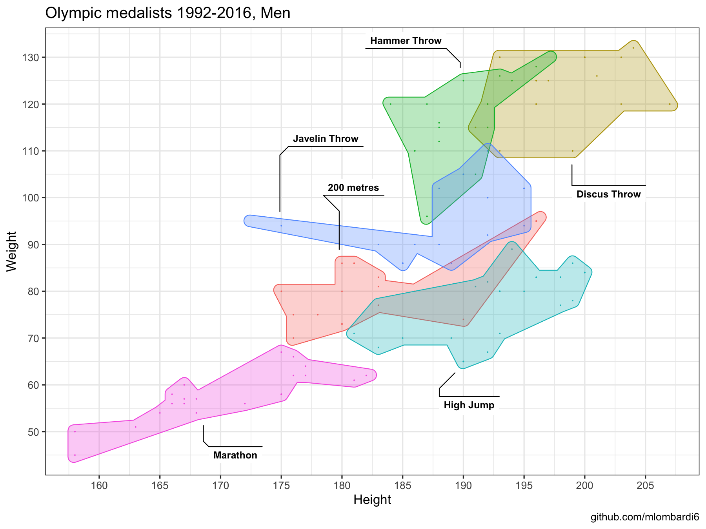
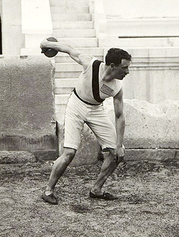

# Anatomy of a discus thrower medalist

Discus medalists similarly to shot put and hammer throwers have an impressive muscle and body structure among track and field athletes. The average height/weight for discus throw medalists between Barcelona 1992 and Rio de Janeiro 2016 was 1.98mt/123kg. On the other end, marathon athletes who require entirely different body attributes for long distance endurance averaged 1.70mt/58kg.

# 2020 champion

The new olympic champion from yesterday is [Daniel Ståhl](https://en.wikipedia.org/wiki/Daniel_St%C3%A5hl) who won the gold medal for Sweden with a throw of 68.90 metres. The Swedish champion is an impressive 2 meters tall and 155kg athlete. He never looked in trouble for the final win, and finished off by shouting "I'm a Swedish Viking!" in his victory lap. 

# Evolution of discus throwers

Discus throw is one of the few modern disciplines who were part of the ancient [Olympic](https://en.wikipedia.org/wiki/Ancient_Olympic_Games) and [Panhellenic](https://en.wikipedia.org/wiki/Panhellenic_Games) games. Back then the anatomy of a discus thrower might have looked like the famous [Discobolus](https://en.wikipedia.org/wiki/Discobolus). The first modern Olympic champion in 1986 was [Robert Garrett](https://en.wikipedia.org/wiki/Robert_Garrett) with 1.88mt and 81kg. By 1948 discus throwers medalists passed in average the 100kg mark and continue the upward trend until recent times.

