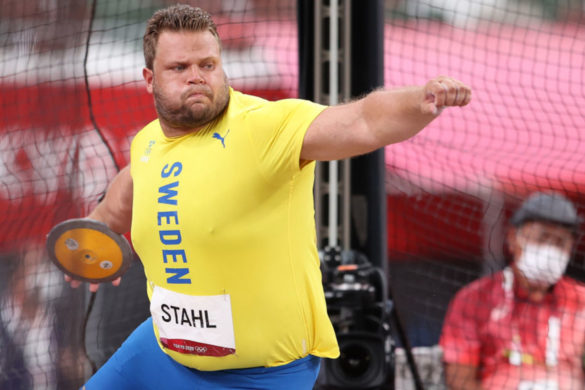

---
title: "TidyTuesday, week 31"
author: "Marco Lombardi"
date: "`r Sys.Date()`"
output: 
  html_document:
    number_sections: no
    self_contained: no
    theme: yeti
    toc: no
---    

\ 

**TidyTuesday Link**

https://github.com/rfordatascience/tidytuesday/blob/master/data/2021/2021-07-27/readme.md

\ 

**Data**

This is a historical dataset on the modern Olympic Games, including all the Games from Athens 1896 to Rio 2016. Source: [Kaggle](https://www.kaggle.com/heesoo37/120-years-of-olympic-history-athletes-and-results?select=noc_regions.csv)

```{r settings, echo=F}
knitr::opts_chunk$set(results='markdown', warning=FALSE, echo=F, message=TRUE, width=200)
knitr::opts_chunk$set(fig.width=12, fig.height=9, dev.args = list(pointsize=14), dpi=75)
knitr::opts_chunk$set(fig.path = "./figures/")

library(tidyverse)
library(data.table)
library(kableExtra)
library(ggplot2)
library(ggforce)
```

```{r load, include=FALSE}
# Either ISO-8601 date or year/week works!
tuesdata <- tidytuesdayR::tt_load('2021-07-27')
tuesdata <- tidytuesdayR::tt_load(2021, week = 31)
dt_olympics <- data.table(tuesdata$olympics)
dt_regions <- data.table(tuesdata$regions)
```


```{r }
data.table(var= c("Name", 
                  "Sex",
                  "Age",
                  "Height",
                  "Weight",
                  "Team",
                  "NOC",
                  "Games",
                  "Year",
                  "Season",
                  "City",
                  "Sport",
                  "Event",
                  "Medal"), 
           desc = c("Athlete's name",
                    "M or F",
                    "Integer",
                    "In centimeters",
                    "In kilograms",
                    "Team name",
                    "National Olympic Committee 3-letter code",
                    "Year and season",
                    "Integer",
                    "Summer or Winter",
                    "Host city",
                    "Sport", 
                    "Event",
                    "Gold, Silver, Bronze, or NA")
) %>%
  kable(format="html") %>%
  kable_styling(bootstrap_options = "striped")
```


```{r discipline}

# Extract sport discipline
dt_olympics<- dt_olympics[, substring := paste(
  sport,
  ifelse(sex=="M", "Men's ", "Women's ") 
  )]
dt_olympics<- dt_olympics[, id_row := 1:.N]
dt_olympics<- dt_olympics[, discipline := gsub(x = event, 
                                               pattern = substring, 
                                               replacement = ""), id_row ]
dt_olympics<- dt_olympics[, ':=' (substring  = NULL, 
                                  id_row = NULL)]
```

\ 

**Anatomy of a discus thrower medalist**

Discus medalists similarly to shot put and hammer throwers have an impressive muscle and body structure among track and field athletes. The average height/weight for discus throw medalists between Barcelona 1992 and Rio de Janeiro 2016 was 1.98mt/123kg. On the other end, marathon athletes who require entirely different body attributes for long distance endurance averaged 1.70mt/58kg.

\ 

```{r}
dt_plot<- dt_olympics[season=="Summer" & 
            !is.na(medal) &
            year >= 1992 &
            sex=="M" &
            sport =="Athletics" & 
            discipline %in% c("Marathon",
                              "200 metres",
                              "High Jump",
                              "Discus Throw", 
                              "Javelin Throw", 
                              "Hammer Throw") & 
            !is.na(weight) & 
            !is.na(height) ] 

dt_plot %>%
  ggplot(aes(height, weight, col=discipline)) +
  geom_point(size=0.2, show.legend = F) +
  geom_mark_hull(aes(col= discipline, fill= discipline, label = discipline),
                 show.legend = F, expand = unit(3, "mm")) +
  theme_bw(base_size = 16) + 
  labs(x="Height", y="Weight", 
       title= "Olympic medalists 1992-2016, Men",
       caption="github.com/mlombardi6") + 
  scale_x_continuous(breaks = seq(150,210,5) ) +
  scale_y_continuous(breaks = seq(50,130,10) )  

```

\ 

# 2020 champion 

The new olympic champion from yesterday is [Daniel Ståhl](https://en.wikipedia.org/wiki/Daniel_St%C3%A5hl) who won the gold medal for Sweden with a throw of 68.90 metres. The Swedish champion is an impressive 2 meters tall and 155kg athlete. He never looked in trouble for the final win, and finished off by shouting "I'm a Swedish Viking!" in his victory lap. 

\ 



\ 

# Evolution of discus throwers

Discus throw is one of the few modern disciplines who were part of the ancient [Olympic](https://en.wikipedia.org/wiki/Ancient_Olympic_Games) and [Panhellenic](https://en.wikipedia.org/wiki/Panhellenic_Games) games. Back then the anatomy of a discus thrower might have looked like the famous [Discobolus](https://en.wikipedia.org/wiki/Discobolus). The first modern Olympic champion in 1986 was [Robert Garrett](https://en.wikipedia.org/wiki/Robert_Garrett) with 1.88mt and 81kg. By 1948 discus throw medalists passed in average the 100kg mark and continue the upward trend until recent times.

\ 

```{r discus_time}
dt_olympics[season=="Summer" & 
            !is.na(medal) &
            sex=="M" &
            discipline =="Discus Throw"  &
            !is.na(weight) & 
            !is.na(height) , 
            .(medalists= .N, 
              avg_height= round(mean(height),2), 
              avg_weight= round(mean(weight),2)), year][order(-year)] %>%

  plot_ly(x=~ year, 
          y=~ avg_weight, 
          z=~ avg_height, 
          type="scatter3d", 
          mode="markers") %>%
  layout(title = "Olympic medalists 1992-2016, Men",
         scene = list(
         xaxis = list(title="Year"), 
         yaxis = list(title="Average Weight"),
         zaxis = list(title="Average Height")))
```

